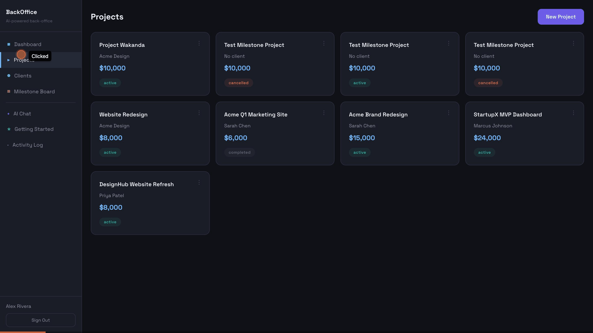

# BackOffice Agent -- Navigation Guide

Live app: https://agenticbackoffice-production.up.railway.app/
Source: https://github.com/BlackPanther01/AgenticBackOffice

> Five AI agents. Zero admin hours.

---

## How It Works

BackOffice Agent replaces 5+ freelancer tools with a single AI-powered platform. When you type a request in the AI Chat, the system analyzes your intent and routes it to the right specialist agent. If your request spans multiple agents, a **Chief Agent** orchestrates them together.

| Agent | Specialty | Tools |
|-------|-----------|-------|
| **Proposal Agent** | Writes proposals with deliverables, timeline, and pricing | get_project_context, get_client_history, get_past_proposals, calculate_pricing, save_proposal |
| **Invoice Agent** | Creates, tracks, and chases invoices | get_project_context, get_project_invoices, create_invoice, update_invoice_status |
| **Contract Agent** | Drafts contracts, reviews incoming ones, flags risky clauses | get_project_context, get_project_proposal, save_contract, flag_clause |
| **Scope Guardian** | Real-time scope creep detection and change order generation | get_project_context, get_contract_scope, calculate_change_order, log_scope_event |
| **Insight Agent** | Revenue analytics, overdue tracking, business health | get_revenue_data, get_overdue_invoices, get_project_pipeline |
| **Chief Agent** | Orchestrates multi-agent workflows when 2+ agents are needed | delegate_to_agent |

Each agent has its own set of database tools (19 tools total, zero overlap). The Chief Agent never does work itself -- it delegates to specialists and synthesizes their results.

### Intent Routing

The system routes your message based on keyword matching:

- **Proposal/quote/bid/estimate** -- Proposal Agent
- **Invoice/bill/payment/charge/deposit** -- Invoice Agent
- **Contract/agreement/terms/clause/legal** -- Contract Agent
- **Scope/creep/extra/additional/quick change** -- Scope Guardian
- **Insight/report/revenue/analytics/how am I doing** -- Insight Agent
- **Multiple agent keywords detected** -- Chief Agent coordinates

### Scope Creep Detection

Before routing your message, the system scans for scope creep indicators (words like "also", "add", "extra", "another", "more", "change", "tweak", "quick", "one more thing"). If detected and you have a project selected, the Scope Guardian runs first, producing a yellow **Scope Alert** before the main response. Messages under 20 characters skip this check.

### Token Budget

Every user has a daily token budget (default: 2,000,000 tokens). Each agent call estimates its token cost before running. If you exceed your budget, you will see a "budget exceeded" message with your usage percentage and token counts. Budget resets daily.

### Cost Tracking

Cost is estimated per interaction using model pricing. The Activity Log shows estimated cost per agent call (~$0.013/interaction average) so you can monitor AI spending.

---

## 1. Sign Up / Sign In

When you first visit the app, you land on the **auth screen** -- a centered card on a dark background with the BackOffice Agent diamond logo and tagline: *"Five AI agents. Zero admin hours."*

- Toggle between **Login** and **Register** using the purple/gray tab buttons at the top of the form.
- **Login** shows two fields:
  - Email
  - Password
  - Purple **"Sign In"** button
- **Register** shows four fields:
  - Name (required)
  - Business name (optional)
  - Email (required)
  - Password (8+ characters, required)
  - Purple **"Create Account"** button
- Errors display in red text above the form.
- After authenticating, you are taken to the **Dashboard**.

---

## 2. Sidebar Navigation

The left sidebar is always visible and uses a dark surface background. It is split into two groups separated by a divider:

**Primary**
| Icon | Item | What it does |
|------|------|-------------|
| ◾ | **Dashboard** | KPI overview -- pipeline value, revenue, outstanding/overdue invoices, active projects, and recent agent activity |
| ▶ | **Projects** | Create, view, edit, and manage freelance projects |
| ● | **Clients** | Add and manage your client contacts |
| ▦ | **Milestone Board** | Kanban-style board showing all milestones across active projects |

**Tools**
| Icon | Item | What it does |
|------|------|-------------|
| ◇ | **AI Chat** | Free-form conversation with your AI agent team |
| ★ | **Getting Started** | Onboarding knowledge base for new freelancers |
| ◎ | **Activity Log** | Full audit trail of every agent call with token/cost tracking |

The active page is highlighted with the primary purple color and a left border accent. At the bottom of the sidebar you will see your account name and a **Sign Out** button.

**Branding** at the top: "BackOffice" in bold, "AI-powered back-office" as subtitle.

---

## 3. Dashboard

The Dashboard loads automatically after login. It shows:

**KPI Cards** -- four cards in a responsive grid across the top, each with a colored top border:
| Card | Border Color | Value | Subtitle |
|------|-------------|-------|----------|
| **Pipeline Value** | Blue | Total budget of active projects | "X active projects" |
| **Revenue (30d)** | Green | Paid invoices in the last 30 days | -- |
| **Outstanding** | Yellow | Unpaid invoice total | -- |
| **Overdue** | Red | Overdue invoice total | "X invoices" or "None" |

**Two-column layout below:**
- **Active Projects** (left panel) -- lists each active project with client name and budget amount. Click any row to jump to its detail view. Empty state: "No active projects".
- **Recent Agent Activity** (right panel) -- shows up to 8 recent agent runs. Each entry has a color-coded agent badge (e.g., green "Invoice Agent", purple "Chief Agent"), duration in milliseconds, and relative timestamp. Empty state: "No recent activity".

Loading state: "Loading dashboard..." while data is fetched.

---

## 4. Projects

### Project List

A responsive grid of project cards. The page heading says "Projects" with a purple **"New Project"** button in the top-right corner.

**Each project card shows:**
- Project name (bold, white text)
- Client name (muted text, or "No client")
- Budget in dollars (green text)
- Status badge: **active** (green), **paused** (yellow), **completed** (gray), or **cancelled** (red)
- **Three-dot menu** icon in the top-right corner of the card

**Three-dot menu options** (appears as a dropdown):
- Set to Active
- Set to Paused
- Set to Completed
- Set to Cancelled

Clicking outside the menu or selecting an option closes it. Cards have a subtle hover effect (border glow).

**Creating a project** -- clicking "New Project" opens an inline form with:
- Project name (required)
- Client (dropdown of existing clients, optional)
- Budget in dollars (number input)
- Description (text input, optional)
- Scope summary (textarea, optional)
- Purple **Create** button and gray **Cancel** button

Click any card body to open the **Project Detail** view.

Empty state: "No projects yet. Create your first project to get started."
Loading state: "Loading..."

### Project Detail

The detail view opens as a full-page replacement. A **"Back to Projects"** link sits at the top-left.

**Header section:**
- Project name (large heading)
- Client name (muted, below)
- Status badge (top-right, color-coded)
- Budget in dollars (top-right, large green text)
- **Edit** button (outlined) and **Delete** button (red outlined)

**Status controls** -- four toggle buttons in a row:
- Active | Paused | Completed | Cancelled
- The current status button is highlighted. Others are dimmed (opacity 0.6).

**Edit mode** -- clicking Edit reveals an inline form:
- Name, Description, Scope summary (textarea), Budget (number)
- **Save** and **Cancel** buttons
- Closes automatically after saving

**Delete confirmation** -- clicking Delete shows a modal:
- "Cancel project '[name]'? This will mark it as cancelled."
- **Delete** and **Cancel** buttons

**Scope summary** -- displayed below status controls if one exists.

#### Quick Agent Actions

Five buttons appear below the header in a row:

| Button | Style | What happens |
|--------|-------|-------------|
| **Generate Proposal** | Outlined | Opens project chat and sends: "Generate a detailed proposal for this project. Include deliverables, timeline, and pricing." |
| **Create Invoice** | Outlined | Opens project chat and sends: "Create an invoice for this project based on the current scope and budget." |
| **Draft Contract** | Outlined | Opens project chat and sends: "Draft a freelancer-friendly contract for this project." |
| **Check Scope** | Outlined | Opens project chat and sends: "Review the current scope status for this project. Flag any scope creep risks." |
| **Open Chat** | Purple filled | Toggles the inline project chat panel open/closed |

#### Project Chat (Inline)

When opened, a chat panel appears below the action buttons. It works identically to the full AI Chat (see Section 6) but is scoped to this project. It includes:
- Message history (scrollable)
- Text input with **Send** / **Stop** buttons
- **Clear** button to reset chat history for this project
- Chat history is stored in localStorage under `chat_[projectId]`

After the AI finishes responding, the project detail auto-refreshes to pick up any newly generated documents.

#### Milestones Panel

A card below the chat section with the heading "Milestones" and three action buttons at the top-right:

| Button | What it does |
|--------|-------------|
| **Refresh** | Re-fetches milestone data from the server |
| **+ Add** | Opens the milestone creation form |
| **Share with Client** | Generates a portal share link and copies it to clipboard |

**Progress bar** -- shows "X of Y approved" on the left and percentage on the right, with a green animated fill bar.

**Milestone creation form** (appears when "+ Add" is clicked):
- Title (required)
- Description (optional)
- Amount in dollars (number input)
- Approval type toggle -- two segmented buttons:
  - **Approval Needed** -- client must approve via portal
  - **Auto-Approve** -- skips client approval step
- **Add Milestone** and **Cancel** buttons

**Milestone stepper** -- a vertical list with connecting lines between milestones:

Each milestone shows:
- **Status icon** (colored circle/shape):
  - ○ hollow = pending (gray)
  - ◑ half = active (purple)
  - ◐ mostly filled = completed (yellow)
  - ◉ filled = approved (green)
  - ✖ = rejected (red)
- **Title** (bold)
- **Amount** in dollars (if > $0)
- **Description** (muted text, if present)
- **Status badge** (right-aligned)
- **Auto-approve badge** (if approval_type is "auto")
- **Rejection reason** (red text, if rejected)

**Milestone actions** -- only the "current" milestone (lowest unfinished) shows action buttons:

| Current Status | Available Actions |
|----------------|-------------------|
| **Pending** | Activate, Delete |
| **Active** | Mark Complete |
| **Rejected** | Activate (re-start) |

**Sequential enforcement** -- milestones must be completed in order. You cannot activate milestone #3 until milestone #2 is approved. This is enforced server-side.

**Completion flow:**
1. Click **Mark Complete** on an active milestone
2. If **Auto-Approve**: milestone immediately moves to "approved" and the next pending milestone auto-activates
3. If **Approval Needed**: milestone moves to "completed" state. A green **completion notice** appears with the share link, auto-copied to your clipboard. The link format is `https://[domain]/portal/[64-char-hex-token]`
4. Send the link to your client for approval via the Client Portal (see Section 8)

**Share with Client button** -- generates a share token (valid for 30 days) and displays the portal URL in an input field with a **Copy** button. The URL is also auto-copied to clipboard.

#### Document Tabs

Below milestones, five tabs organize project documents. Each tab shows a count in parentheses. A **Refresh** button on the far right reloads documents.

| Tab | Contents |
|-----|----------|
| **Proposals (N)** | AI-generated proposals |
| **Invoices (N)** | Generated invoices with line items |
| **Contracts (N)** | Drafted contracts with flagged clauses |
| **Scope Events (N)** | Scope creep detections and change orders |
| **Milestones (N)** | Flat list of all milestones |

**Proposals, Invoices, Contracts** -- each document is a collapsible card:
- Click the header to expand/collapse
- **Download** button -- exports as JSON file
- **Delete** button -- shows confirmation modal ("Delete this [type]?")

**Invoice details** (expanded):
- Due date
- Total amount (large, bold)
- Line items table: description, quantity (if > 1), rate

**Contract details** (expanded):
- Full contract content
- **Flagged clauses** section (if any):
  - Clause text
  - Severity badge: **HIGH** (red) or **WARNING** (yellow)
  - Explanation text

**Scope Events** -- each event shows:
- Event type badge (change_order, approved, rejected, etc.)
- Description text
- Estimated cost (if present)
- **Delete** button with confirmation

**Milestones tab** -- simple card list showing title, amount, and status badge for each milestone.

Empty states: "No proposals yet.", "No invoices yet.", "No contracts yet.", etc.

---

## 5. Clients

A list view with the heading "Clients" and a purple **"Add Client"** button in the top-right corner.

**Each client row shows:**
- Client name (bold, white text)
- Email and company name (dot-separated, muted text)
- **Edit** button (outlined) and **Delete** button (red outlined) on the right

**Client form** (appears inline at top when adding or editing):
- Name (required)
- Email (email input, optional)
- Company (optional)
- Notes (textarea, optional)
- **Create** / **Update** button (context-dependent) and **Cancel** button

**Delete confirmation** -- modal with "Delete this client?" message and Delete/Cancel buttons.

Clients are linked to projects via the client dropdown in the project creation form.

Empty state: "No clients yet. Add your first client to get started."
Loading state: "Loading..."

---

## 6. AI Chat

The AI Chat is the core of the platform. It connects you to the full team of five specialized agents through a single conversation interface.

**Header:**
- "AI Chat" heading
- **Project selector** dropdown (next to heading) -- choose "All projects" for general queries or select a specific project to scope the conversation

**Empty state** (when no messages exist):
- Diamond icon (centered)
- "Ask your AI back-office team anything"
- "Your Chief Agent will route to the right specialist."
- Three quick action buttons:
  - **"How am I doing?"** -- sends "How am I doing this month? Give me a full business overview."
  - **"Overdue invoices?"** -- sends "Do I have any overdue invoices? What should I do about them?"
  - **"Pipeline status"** -- sends "What does my project pipeline look like right now?"

**Message input** -- fixed at the bottom of the chat:
- Textarea with "Ask your AI team..." placeholder
- Dynamic height (grows with content, max ~120px)
- **Send** button (purple) -- visible when not streaming
- **Stop** button (red) -- visible while agents are working, cancels the stream

### How Agent Responses Work

**User messages** -- right-aligned bubbles with purple background.

**Assistant messages** -- left-aligned bubbles with dark surface background and border. Each message can contain:

1. **Agent badges** -- colored pills at the top showing which agents handled the request:
   - Chief Agent (purple)
   - Proposal Agent (blue)
   - Invoice Agent (teal/green)
   - Contract Agent (orange/salmon)
   - Scope Guardian (yellow)
   - Insight Agent (light purple)

2. **Delegation indicators** -- when the Chief Agent routes to a specialist, you see a colored left-border line with "Delegated to [Agent Name]" text.

3. **Tool call pills** -- collapsible pills showing database operations:
   - Arrow direction: → for call, ← for result
   - Tool name (e.g., "get_project_context", "save_proposal")
   - Click the ▶/▼ toggle to expand/collapse
   - Expanded view shows JSON input/output in a code block

4. **Main content** -- the agent's response text with basic markdown support (bold, code, lists, paragraphs).

5. **Completion stats** -- after each agent finishes: duration (seconds) and token count.

6. **Copy button** -- copies the assistant's response text to clipboard.

7. **Error display** -- if an agent fails, the error appears in red text within the message.

**Scope Alert messages** -- special yellow-bordered messages that appear before the main response:
- Warning icon
- "Scope Alert Detected" header
- Reason text explaining why this might be scope creep
- Analysis content from the Scope Guardian

**Streaming indicators:**
- Animated typing dots (3 bouncing dots) while agents are working
- Active agent indicators in the chat header (colored dots + agent names)
- "Working..." label

**Budget exceeded** -- if your daily token budget is hit, a budget_exceeded error appears in the chat with your usage percentage.

**Chat history** is saved per-project in browser localStorage. Switching the project dropdown saves the current chat and loads the selected project's history. Use the **Clear** button to reset.

### Multi-Agent Workflows

Some requests trigger multi-agent workflows:

**Onboarding workflow** ("set everything up for this project"):
1. Proposal Agent generates a proposal
2. Contract Agent drafts a contract aligned with the proposal
3. Invoice Agent creates a 50% deposit invoice

Each step's output informs the next. The Chief Agent coordinates and summarizes the results.

---

## 7. Milestone Board (Kanban)

A board view with the heading "Milestone Board" and subtitle "All milestones across active projects". Four columns, each with a count badge and colored header:

| Column | Header Color | Meaning |
|--------|-------------|---------|
| **Pending** | Gray | Milestone is queued, not yet started |
| **In Progress** | Purple | Currently being worked on |
| **Awaiting Approval** | Yellow | Submitted for client review |
| **Approved** | Green | Client has signed off |

**Each milestone card shows:**
- Milestone title (bold)
- Project name (muted text)
- Dollar amount (green, if > $0)
- Auto-approve badge (if applicable)
- Hover effect on cards

Click any card to navigate directly to that project's detail view.

Empty column state: "No milestones"
Loading state: "Loading milestones..."

The board loads milestones from up to 10 active projects.

---

## 8. Client Portal (Public)

When you share a milestone link with a client, they access a **public portal** at `/portal/<token>` -- no login required. The token is a 64-character hex string, valid for 30 days.

**Portal layout:**
- **Header** -- project name (large) and freelancer name / business name
- **Progress section** -- "Project Progress" label, "X of Y milestones approved (Z%)", green progress bar
- **Milestone stepper** -- vertical list of all milestones with status icons, identical to the freelancer's view

**Milestone statuses shown:**
- Pending (gray), Active (purple), Completed (yellow), Approved (green), Rejected (red)
- Each milestone shows: title, amount, description, status badge
- Approved milestones show the approval date in green
- Rejected milestones show the rejection reason in red

**Client actions** (only for milestones in "completed" status):
- **Approve** button (green) -- approves the milestone, auto-activates the next pending one
- **Request Changes** button (outlined) -- opens an inline textarea for the client to type a rejection reason, then:
  - **Send** button submits the rejection (milestone returns to "active" with the reason stored)
  - **Cancel** button dismisses the form

**Auto-refresh** -- the portal polls every 5 seconds to stay in sync with the freelancer's updates. No loading indicator is shown during refresh.

**Error states:**
- Invalid/expired token: centered diamond icon with error message
- No milestones: "No milestones have been added to this project yet."
- Loading: "Loading..."

**Footer:** "Powered by BackOffice Agent" (subtle, centered)

---

## 9. Getting Started (Onboarding KB)

A page with the heading "Getting Started" and subtitle "Three things every new freelancer needs to know". Three expandable cards:

**1. Set Your Rate**
- Research market rates for your skill set
- Account for taxes (~30% for 1099 contractors)
- Factor in costs: software, equipment, health insurance
- Formula: (desired salary + expenses + taxes) / billable hours
- Start hourly, transition to project-based pricing

**2. Land Your First Client**
- Leverage your existing network first
- Build a portfolio (2-3 strong examples)
- Position yourself as a specialist, not a generalist
- Send 5 targeted outreach messages per day
- Follow up within 24 hours of initial contact

**3. Protect Your Work**
- Always use a contract, even for small projects
- Key terms to include:
  - Scope of work (specific deliverables)
  - Payment schedule (50% upfront is standard)
  - Revision limits (2-3 rounds)
  - IP ownership (transfers on final payment)
  - Kill fee (25-50% if client cancels)
  - Timeline with milestones
- Use BackOffice Agent to generate and track contracts

Click any card's arrow to expand/collapse. The arrow rotates 180 degrees when expanded. Each expanded section has a colored top border.

---

## 10. Activity Log

Full audit trail of every AI agent interaction. Heading: "Activity Log" with a purple **"Export Logs"** button in the top-right corner (disabled when no logs exist).

**Summary cards** -- four KPI-style cards with colored top borders:
| Card | Border Color | Value |
|------|-------------|-------|
| **Total Calls** | Teal | Number of agent invocations |
| **Total Tokens** | Purple | Cumulative token usage |
| **Total Time** | Green | Cumulative processing time (seconds) |
| **Est. Cost** | Yellow | Estimated dollar cost |

**Agent Usage** section -- colored badge pills for each agent showing call count (e.g., "Chief Agent: 9", "Proposal Agent: 11", "Invoice Agent: 13"). Click a badge to **filter** the log to that agent only. Click again or use the **Clear filter** button to reset.

**Log entries** -- each entry is a collapsible row showing:
- ▶ expand/collapse toggle
- Agent name (color-coded badge)
- Project name (muted text)
- Duration (seconds, 1 decimal)
- Token count (total)
- Estimated cost (green text)
- Relative timestamp ("16h ago", "2d ago")

**Expanded entry details:**
- Input tokens with progress bar (0-20k scale)
- Output tokens with progress bar (0-5k scale)
- Model name (e.g., claude-haiku-4-5-20251001)
- Duration (seconds)
- Estimated cost (green text)
- Full ISO timestamp

**Export** -- downloads a JSON file named `activity-log-YYYY-MM-DD.json` containing summary stats and all log entries with estimated costs.

Empty state: "No agent activity yet."
Loading state: "Loading..."

---

## Keyboard Shortcuts

| Shortcut | Where | Action |
|----------|-------|--------|
| **Enter** | Chat input | Send message |
| **Shift+Enter** | Chat input | New line |

---

## State Persistence

The app remembers the following across page refreshes (stored in browser localStorage):

| Data | Key | Behavior |
|------|-----|----------|
| Auth token | `token` | Stays logged in until Sign Out |
| Current view | `currentView` | Restores your last page on refresh |
| Chat history | `chat_[projectId]` or `chat_all` | Preserves conversations per project |

All localStorage data is cleared on Sign Out.

---

## Rate Limits

The API enforces rate limits to prevent abuse:

| Endpoint Type | Limit |
|---------------|-------|
| Auth (login/register) | 5 requests per minute |
| Agent calls (chat, generate) | 10 requests per minute (production) |
| General API (CRUD, dashboard) | 30 requests per minute |

Exceeding limits returns a 429 error.

---

## Tips

- **Scope creep protection is automatic.** When you ask the AI chat something that might be outside project scope, the Scope Guardian intervenes with a yellow alert before the main response. It never just says no -- it offers the paid path forward with a change order.
- **Documents are generated in real-time.** After an agent creates a proposal, invoice, or contract, the project detail auto-refreshes to show new documents in the tabs.
- **Milestones are sequential.** You cannot skip ahead -- each milestone must be activated and approved before the next one can start. This is enforced server-side as a trust guarantee for clients.
- **Auto-approve milestones** skip the client approval step and move directly from completed to approved. Useful for internal milestones or trusted client relationships.
- **Chat history persists** across page refreshes per-project in browser local storage.
- **View state persists** across refreshes -- the app remembers which page you were on.
- **Cost is tracked per interaction.** The Activity Log shows estimated cost per agent call, so you can monitor AI spending.
- **The three-dot menu** on project cards lets you quickly change status without opening the project.
- **Agent model selection is strategic.** Complex tasks (proposals, contracts, scope analysis) use more capable models for nuanced output. Routine tasks (invoicing, analytics) use faster, cheaper models.
- **Contracts automatically flag risky clauses.** The Contract Agent identifies problematic terms (unlimited revisions, unfavorable arbitration, non-competes) and flags them with severity levels.
- **The Proposal Agent never underprices.** If the project budget is less than the calculated price, it adds a "Budget Advisory" but saves at full price as an anchor.
- **Share links expire after 30 days.** Generate a new one if the old link has expired.
- **Tool call pills** let you see exactly what database operations each agent performed. Click to expand and inspect the input/output JSON.
- **"Set everything up"** in the chat triggers a full onboarding workflow: proposal, then contract aligned with the proposal, then a 50% deposit invoice.
