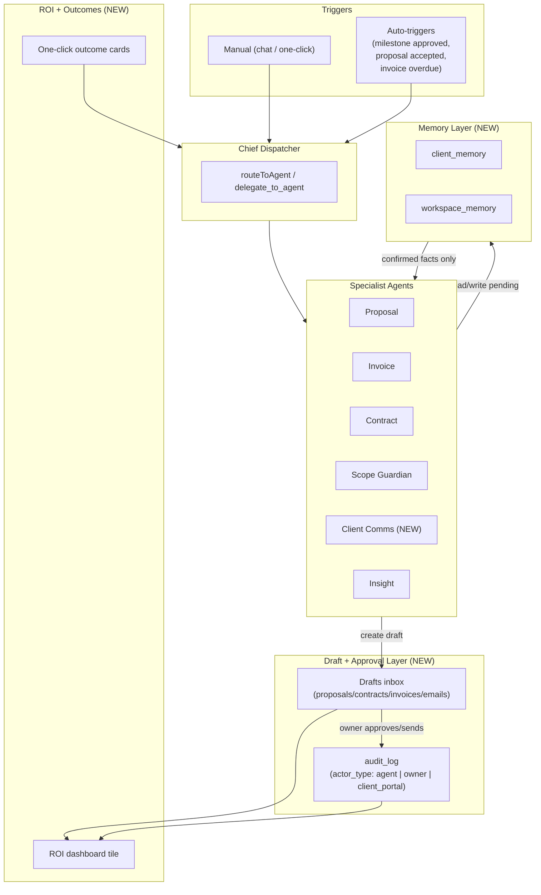

# BackOffice — Judge Feedback Integration Plan

## Context

Judges' feedback boils down to one concern: "Is this just GPT wrappers?" The fix is to make the agents feel like an autonomous operations team — with **memory**, **automatic triggers**, **measurable ROI**, and a **human approval layer** that encodes trust. Brent's notes add: hide the multi-agent loading chatter behind a single cohesive preloader, verify outputs end-to-end, ship an onboarding guide.

This plan turns BackOffice from "five chat agents" into "an AI operations team that drafts, remembers, triggers, and reports — with the human always in the loop." It is intentionally additive: existing schema, routes, and agent-config stay; we extend rather than rewrite.

---

## BEFORE — Project Snapshot (today)

**Agents (all Haiku 4.5).** `server/agents/agent-config.js`:
- `proposal`, `invoice`, `contract`, `scope_guardian`, `insight`, `chief` (orchestrator with `delegate_to_agent`).
- Routing: `routeToAgent()` in `server/agents/dispatcher.js` keyword-scores; 2+ matches → Chief.
- Workflows: `onboardingWorkflow`, `scopeCheckWorkflow`.

**Tools (`server/agents/tools.js`).** 16 tools, each scoped by `user_id`. Result cap 2000 chars. No memory tools, no draft/approval tools, no email-send tools.

**Schema (`server/schema.sql`).** `users`, `clients`, `projects`, `proposals`, `invoices`, `contracts`, `scope_events`, `agent_logs`, `milestones`, `share_tokens`. Drafts only exist as a `status='draft'` enum; no confidence, no actor, no audit log.

**Approval surface (today).** Only milestones have an approval gate, via the public `share_tokens` portal (`server/routes/client-portal.js`). Proposals/contracts/invoices are saved by agents directly with `status='draft'` and no human gate before "send."

**Auto-triggers (today).** None. Everything is user-initiated through `/api/agents/*`. The chat path has one proactive behavior: `detectScopeCreep()` in `server/routes/agents.js` runs Scope Guardian when keywords match.

**RBAC (today).** Single-tenant per user. `WHERE user_id = $1` on every query. Public client portal via 32-byte expiring `share_tokens`. No agent-vs-human actor distinction in any log. JWT 7-day, localStorage (known tech debt).

**Frontend (`src/App.jsx`, 2,174 lines).** Chat shows `agent_start` / `delegation_start` / `agent_complete` events as visible badges and per-agent durations + token counts — Brent flagged this as too noisy.

---

## 5-Perspective Stress Test (3-pass)

I stress-tested each addition through five lenses, three passes each, and only kept items that survived all three.

| Lens | Pass 1: Does it work? | Pass 2: Does it break something? | Pass 3: Is it worth it? |
|---|---|---|---|
| **Security** | Memory + auto-triggers expand attack surface | Prompt-injection from client-supplied content into memory; webhook spoofing; portal must never leak memory | All AI-extracted memory enters as `pending` until owner approves; webhooks deferred to Phase 2; portal payload allowlist enforced |
| **Data model** | Need: client_memory, audit_log, drafts metadata, automation_rules | Avoid breaking existing JSONB shapes; keep migrations additive | Use ALTER TABLE adds + new tables only; no destructive change |
| **Agents/prompts** | Need Client Comms agent + memory tools | Token bloat from memory reads + more iterations | Cap memory reads at 10 facts, ≤120 chars each, cached system prompts unchanged |
| **UX** | Cohesive preloader, drafts inbox, ROI tile, one-click outcomes | Don't bury existing chat power-users | Verbose-mode toggle preserves current view; preloader is default |
| **Judge/pragmatic** | Memory + auto-triggers + draft+approve + ROI = the demo story | Multi-channel ingest is too big for 30 days | Cut Gmail/Slack/WhatsApp; keep Phase 1 focused |

**Decisions surviving all three passes:** Memory layer, draft+approval+audit+confidence, Client Comms agent, three internal auto-triggers (no webhooks), ROI endpoint+tile, one-click outcomes, preloader, onboarding guide. **Cut from this round:** Stripe/Gmail/Slack/WhatsApp ingest, multi-user workspaces.

---

## RBAC — what makes sense for BackOffice

Today is single-tenant per freelancer. We don't need teams yet. The judge feedback's "human approval layer" *is* the RBAC story for BackOffice. We model **four actor types** in the audit log and authorization checks:

| Actor | Can do | Cannot do |
|---|---|---|
| **owner** (the freelancer/agency user) | Everything in their workspace | Cross-tenant access |
| **agent** (system actor when an agent acts) | Create drafts, log scope events, write `pending` memory | Send/finalize anything; write `confirmed` memory directly |
| **client_portal** (share-token visitor) | Read project portal, approve/reject milestones | Read drafts, memory, agent_logs, anything not exposed by `client-portal.js` |
| **(future) approver** | Reserved column only — not wired in v1 | — |

This stays minimal: one `actor_type` column on the audit log, a `requires_approval` flag on agent-created docs, and a `confidence` score. No new role tables, no permission matrix to maintain.

---

## AFTER — Recommended Approach

### Architecture diagram

### Phase 1 — Ship in this round (the demo story)

**1A. Memory layer** — `server/schema.sql` (additive)
- New table `client_memory(id, user_id, client_id, category, key, value, confidence, source, status, created_at, updated_at)`. `category ∈ ('payment_pref','comm_tone','red_flag','pricing_history','other')`. `source ∈ ('agent','owner')`. `status ∈ ('pending','confirmed')`. Unique `(user_id, client_id, category, key)`.
- New table `workspace_memory(id, user_id, category, key, value, confidence, source, status, …)` — same shape, no `client_id`.
- Indexes on `(user_id, client_id)` and `(user_id, status)`.
- New tools in `server/agents/tools.js`:
  - `read_client_memory(client_id, category?)` — returns ≤10 confirmed facts, value truncated to 120 chars.
  - `write_client_memory(client_id, category, key, value, confidence)` — writes `status='pending'`, `source='agent'`. Owner promotes to `confirmed` via UI.
  - `read_workspace_memory(category?)` / `write_workspace_memory(...)` — same pattern.
- Wire memory tools into Proposal, Contract, Scope Guardian, Client Comms, Insight (NOT into Invoice — keep invoice deterministic).
- New routes `server/routes/memory.js`: `GET /api/memory/clients/:client_id`, `PATCH /api/memory/:id` (promote/edit/delete), `POST /api/memory` (owner-authored).

**1B. Draft + approval + audit + confidence** — additive
- ALTER `proposals`, `invoices`, `contracts` ADD COLUMN `confidence NUMERIC(3,2)`, `requires_approval BOOLEAN DEFAULT TRUE`, `approved_by UUID REFERENCES users(id)`, `approved_at TIMESTAMPTZ`, `sent_at TIMESTAMPTZ`.
- Status flow becomes `draft → pending_approval → approved → sent`. Add `'pending_approval'` to each status CHECK. Existing `'draft'` stays for owner-authored items not yet ready.
- New table `audit_log(id, user_id, actor_type, actor_id, action, resource_type, resource_id, before_state JSONB, after_state JSONB, created_at)`.
- Agents always create with `status='pending_approval'`, `requires_approval=TRUE`. Final-send (`POST /api/proposals/:id/send`, `/api/invoices/:id/send`, `/api/contracts/:id/send`) is owner-only and writes `audit_log` with `actor_type='owner'`.
- Confidence: each agent adds a final `set_confidence(score, reasoning)` tool call (new tool). Score < 0.7 → keep `pending_approval` regardless of owner setting.
- New route `server/routes/drafts.js`: `GET /api/drafts` returns the cross-resource pending queue with confidence + agent + reasoning.

**1C. Client Comms Agent** — `server/agents/agent-config.js`
- Add `client_comms` to `AGENTS` and `agent_logs.agent` CHECK constraint (ALTER TABLE).
- System prompt (≤200 words): freelancer-tone email drafter for payment reminders, scope pushback, milestone updates, project kickoff. Pulls memory for tone.
- Tools: `get_project_context`, `get_client_history`, `read_client_memory`, `read_workspace_memory`, `draft_email` (new — writes to a new `email_drafts` table with `status='pending_approval'`), `set_confidence`.
- Add to dispatcher's `delegate_to_agent` enum and `intentPatterns` (`['email','reminder','follow up','message','reply','draft a note']`).
- New table `email_drafts(id, user_id, project_id, client_id, subject, body, purpose, confidence, status, approved_by, approved_at, sent_at, created_at)`.

**1D. Auto-triggers (internal only — no external webhooks)** — `server/routes/`
- Hook points are existing route handlers (no new infra):
  - `milestones.js` after a milestone moves to `approved` (both owner-side and `client-portal.js`) → enqueue Invoice draft for that milestone amount.
  - `documents.js` (or new `proposals.js`) after a proposal moves to `accepted` → enqueue Contract draft + 50% deposit Invoice draft (reuse `onboardingWorkflow` minus proposal step).
  - Background sweep (Postgres `NOTIFY` is overkill — use a 5-minute `setInterval` in `server/index.js` guarded by `process.env.AUTO_TRIGGERS=on`) marks `invoices` with `due_date < now AND status='sent'` as `overdue` and enqueues a Client Comms follow-up draft.
- New table `automation_runs(id, user_id, trigger_type, trigger_resource_id, action_agent, draft_id, status, created_at)`.
- Each trigger calls `runAgent(...)` server-side and writes the result as a draft + audit log entry (`actor_type='agent'`). User sees them in the new Drafts inbox — never auto-sent.
- Token-budget gate (`token-budget.js`) applies as today; failed budget check downgrades to a `notification` row instead of an agent run.

**1E. ROI metrics** — derive, don't fabricate
- New endpoint `GET /api/dashboard/roi` computed from existing data:
  - **Scope creep blocked** = `SUM(estimated_cost_cents)` from `scope_events` where `event_type='change_order'` in window.
  - **Avg collection time** = `AVG(paid_at - sent_at)` (requires `sent_at` already added in 1B + new `paid_at` ALTER on `invoices`). If < 5 datapoints, return `null` with `samples` count instead of fake numbers.
  - **Proposal close rate** = `accepted / sent` over 90 days from `proposals.status`.
  - **Hours saved** = sum of agent runs × per-agent baseline minutes (constants in `server/agents/roi-baselines.js`: proposal=45m, invoice=10m, contract=30m, scope=15m, comms=10m). Conservative; documented as "estimate based on typical manual time."
- New ROI tile in `src/App.jsx` dashboard view, four numbers, each with a tooltip linking the calculation.

**1F. One-click outcomes** — frontend cards + thin endpoints
- Four cards on dashboard: "Recover late payments" → comms follow-ups for all overdue invoices; "Price this project properly" → opens project picker → proposal agent with calc_pricing-first flow; "Turn messy notes into a signed proposal" → textarea → onboarding workflow; "Protect me from scope creep" → opens chat with Scope Guardian primed on a paste-email field.
- Each maps to existing endpoints (no new agent code) — only thin wrappers in `server/routes/agents.js` if needed.

**1G. UX polish (Brent's notes)**
- **Cohesive preloader**: replace the per-agent badge stream during `chatStreaming` with a single "BackOffice is working…" loader (Framer Motion shimmer over a 3-step progress: *Thinking → Drafting → Reviewing*). Verbose-mode toggle keeps current view for power users. Drive purely from existing SSE events; no protocol change. Edits in `src/App.jsx` around lines 707–778, 1040–1090.
- **Onboarding guide**: new `users.onboarded_at TIMESTAMPTZ`. On first login (`onboarded_at IS NULL`), show a 4-step modal (Add a client → Create a project → Generate a proposal → Approve and send). Stored as `src/components/OnboardingTour.jsx`. Mark complete via `POST /api/auth/onboarded`.
- **End-to-end output check**: dev-only `npm run smoke` script (Vitest) that registers a temp user, runs onboarding workflow, asserts proposal/contract/invoice each land as `pending_approval` with confidence set, then approves and asserts audit_log + ROI numbers update.

### Phase 2 — Roadmap, NOT in this round
- Stripe webhook → invoice paid trigger (signature verification with `STRIPE_WEBHOOK_SECRET`).
- Gmail / Slack / WhatsApp ingest as scope-creep sources.
- Multi-user workspaces (agency mode) with `workspace_id` on all tables and a `memberships` table.
- Tighten `db.js` `rejectUnauthorized: true`; move JWT to HttpOnly cookie. (Existing tech debt — flagged but not in this scope.)

---

## Critical files to modify

- `server/schema.sql` — new tables (client_memory, workspace_memory, audit_log, email_drafts, automation_runs); ALTER on proposals/invoices/contracts/users/agent_logs.
- `server/migrate.js` — already runs schema.sql; ensure idempotent ALTERs (`ADD COLUMN IF NOT EXISTS`, etc.).
- `server/agents/tools.js` — add memory tools, `set_confidence`, `draft_email`.
- `server/agents/agent-config.js` — register `client_comms`; wire memory tools into existing agents; add `set_confidence` to every agent's tool list.
- `server/agents/dispatcher.js` — extend `MAX_DELEGATION_DEPTH` (no change), include `client_comms` in delegation enum (in `delegate.js`).
- `server/agents/delegate.js` — add `'client_comms'` to `agent_id` enum.
- `server/routes/agents.js` — add `/api/agents/comms/draft` mirror endpoint; auto-trigger orchestration helpers.
- `server/routes/milestones.js`, `server/routes/client-portal.js` — fire invoice-draft trigger on milestone approval.
- `server/routes/dashboard.js` — `/api/dashboard/roi` endpoint or merge into existing `/`.
- New: `server/routes/memory.js`, `server/routes/drafts.js`, `server/agents/roi-baselines.js`, `server/agents/auto-triggers.js`.
- `server/schemas/index.js` — Zod for memory, drafts, comms.
- `server/index.js` — mount new routers; guarded `setInterval` for overdue sweep.
- `src/App.jsx` — preloader, drafts inbox, ROI tile, one-click cards, memory drawer; component extraction is *not* required for this round.
- New: `src/components/OnboardingTour.jsx`, `src/components/DraftsInbox.jsx`, `src/components/MemoryDrawer.jsx`, `src/components/RoiTile.jsx`, `src/components/AgentPreloader.jsx`.

## Reuse, don't reinvent

- **Streaming**: existing SSE pipeline in `dispatcher.js` + `runWorkflow` covers every new agent path. Auto-triggers call `runAgent()` directly.
- **Workflows**: `onboardingWorkflow` already chains proposal → contract → invoice; the proposal-accepted trigger reuses it minus the first step.
- **Token budget**: `token-budget.js` `checkBudget()` already gates expensive operations; auto-triggers reuse it.
- **User-scoping**: every tool already takes `userId`; new tools follow the same pattern.
- **Audit identity**: existing `agent_logs` records the agent run; the new `audit_log` records the *resource lifecycle* (draft → approve → send) — they're complementary, not redundant.

## Verification

- **Unit**: Vitest tests for memory tool read/write (pending vs confirmed visibility), confidence-score gate (low confidence forces `pending_approval`), audit_log insertion on send.
- **Integration**: `npm run smoke` end-to-end as described in 1G.
- **Manual**: `npm run dev` → register → run onboarding workflow → confirm all three resources land in Drafts → approve invoice → confirm audit_log + ROI tile updates → mark a milestone approved on the portal → confirm a new Invoice draft auto-appears.
- **Security checks**: hit `GET /portal/:token` and grep response for any field from `client_memory` / `audit_log` / `agent_logs` (must be empty); attempt to write memory as another `user_id` (must 404); confirm low-confidence agent output cannot be `sent` until approved.
- **Lint + build**: `npm run lint && npm run build && npm test` must pass.
